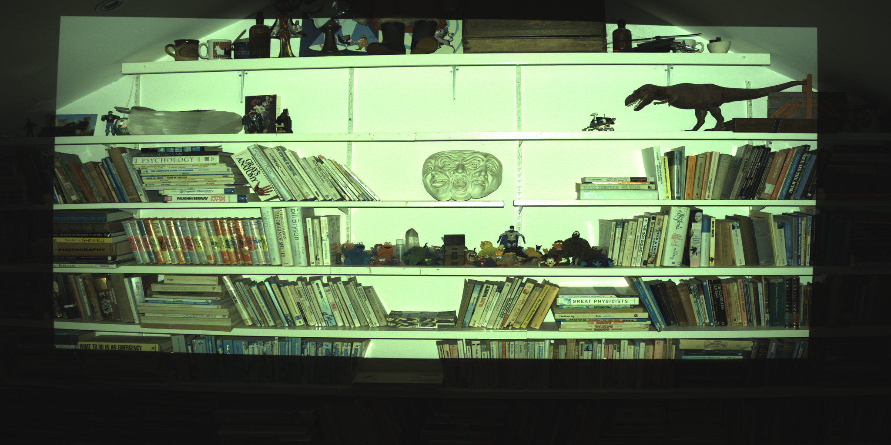
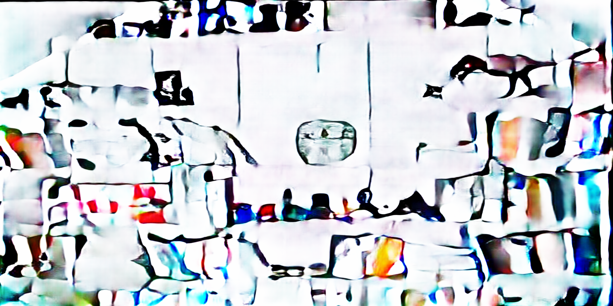
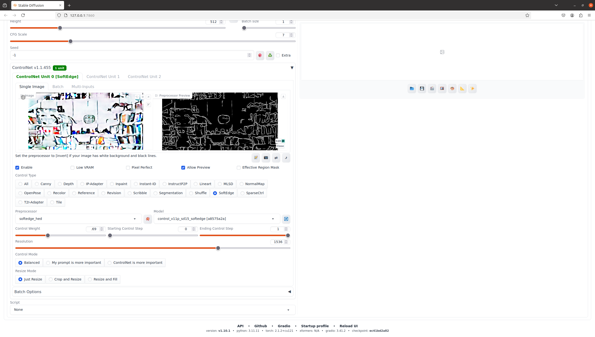

# Unsupervised Projector–Camera Mapping with Pix2PixHD

**Abstract**  
This repository demonstrates an **unsupervised** workflow for learning how a scene transforms projected images into camera observations—akin to identifying a transfer function in control theory. We capture “emission”–“recording” pairs automatically, train a high-resolution Pix2PixHD model to approximate the scene’s inverse response, and then leverage external style pipelines (ComfyUI, Stable Diffusion, etc.) to stabilize or creatively guide the final appearance.  

No labeled data or explicit calibration is needed: the system learns purely from raw projector–camera interactions. Below are the main steps, plus optional paths for static animations or fully interactive feedback loops.

---

## 1. Data Capture
**Script:** `record_dtd_dataset.py`  
1. **Project Emission (Step Input):** Displays a pattern (e.g., from DTD textures) via the projector.  
2. **Capture Recording (Step Response):** Saves the camera’s reaction in `Recordings/`.  
3. **Alignment:** The same filename is used in `Emissions/`, matching each pair \((E_i, R_i)\).

---

## 2. Data Preparation
**Script:** `crop_and_prepare_pix2pixHD_dataset.py`  
1. **Crop & Resize:** Optionally remove unwanted vertical space, then resize both emissions and recordings (e.g., 2048×1024).  
2. **Aligned Folders:** Place camera images in `train_A` and projector images in `train_B`.

---

## 3. Pix2PixHD Training
**Script:** `train.py`  
1. **Input/Output Setup:** The “recording” (\(A\)) is the input, and the matching “emission” (\(B\)) is the target.  
2. **GAN & Losses:** Pix2PixHD uses adversarial, feature matching, and optionally VGG-based perceptual losses.  
3. **Checkpoints:** Trained weights (`.pth` files) are saved at intervals.

This trains a function from the camera view back to the projector domain. **By itself**, Pix2PixHD is a single transformation—unstable if placed in a direct feedback loop.

The cropped, resized step response and resultant predicted emission are illustrated below.

|  |  |
| ------------------------------------------------------------ | ------------------------------------------------------------ |
| `Step Response`                               | `Resultant Predicted Emission`                              |

---

## 3.5. Optional Animation & Off-Line Styling
Before moving to real-time control, you can use the trained generator’s predicted emissions as static inputs to:
- **Deforum** for music-synchronized or timeline-based animations,  
- **Stable Diffusion WebUI** (e.g., for prompt-driven transformations),  
- **Any offline pipeline** that modifies or stylizes the emitted image.

This produces **non-interactive** animations or edited frames for a static scene—no projector feedback involved. You simply pass the generator’s output to your creative or style framework, then (if desired) project the final frames afterward.
<figure style="text-align: center;">
  
  <figcaption>Pix2PixHD's predicted Emmission from the step response being input to ControlNet</figcaption>
</figure>

---

## 4. Real-Time Inference & Stabilized Feedback

- **Script:** `call_rec2emis_comfui.py`  
- **Process:**  
  1. Capture the environment (camera feedback).  
  2. Run the Pix2PixHD generator (raw function).  
  3. Incorporate external “style” or pose constraints (ComfyUI, etc.).  
  4. Project the updated emission.  
  5. In future capture again, and repeat.  While stable loops have been demonstrated with Fast Style Transfers, the time per iteration here has made experimentation cumbersome.  Future research may be performed on mannequins.

ComfyUI or other style pipelines stabilize and guide the loop. Without them, a naive feedback can oscillate or diverge. This approach enables fully **interactive** illusions or environment transformations.

---

## 5. Future RL Integration
This pipeline can also bootstrap a reinforcement learning (RL) agent: by using Pix2PixHD (plus stylization) as part of an environment model, an RL policy could learn to optimize projector outputs for specific objectives—extending the concept to more sophisticated, policy-driven tasks.

---

## Sample Outputs

Below are clickable thumbnails from the `samples/` directory. Images were captures with an industrial camera, and may appear dull to the human eye. Video the Reality Transform captured with conventional cameras is available on social media. Click any image to enlarge:

|  |  |
| ------------------------------------------------------------ | ------------------------------------------------------------ |
| `20250208_222930_iter_001.png`                               | `20250208_225430_iter_001.png`                               |

|  |  |
| ------------------------------------------------------------ | ------------------------------------------------------------ |
| `20250208_225557_iter_001.png`                               | `20250208_225929_iter_001.png`                               |

|  |  |
| ------------------------------------------------------------ | ------------------------------------------------------------ |
| `20250208_230013_iter_001.png`                               | `20250208_230432_iter_001.png`                               |

|  |  |
| ------------------------------------------------------------ | ------------------------------------------------------------ |
| `20250208_230731_iter_001.png`                               | `20250208_231545_iter_001.png`                               |

|  |  |
| ------------------------------------------------------------ | ------------------------------------------------------------ |
| `20250208_231715_iter_001.png`                               | `20250208_231800_iter_001.png`                               |

|  |  |
| ------------------------------------------------------------ | ------------------------------------------------------------ |
| `20250209_005506_iter_001.png`                               | `20250209_005602_iter_001.png`                               |

|  |  |
| ------------------------------------------------------------ | ------------------------------------------------------------ |
| `20250209_005754_iter_001.png`                               | `20250209_005850_iter_001.png`                               |

|  |  |
| ------------------------------------------------------------ | ------------------------------------------------------------ |
| `20250209_010116_iter_001.png`                               | `20250209_010206_iter_001.png`                               |

|  |  |
| ------------------------------------------------------------ | ------------------------------------------------------------ |
| `20250209_010255_iter_001.png`                               | `20250209_010345_iter_001.png`                               |

|  |  |
| ------------------------------------------------------------ | ------------------------------------------------------------ |
| `20250209_011728_iter_001.png`                               | `20250209_011817_iter_001.png`                               |

|  |  |
| ------------------------------------------------------------ | ------------------------------------------------------------ |
| `20250209_011907_iter_001.png`                               | `20250209_012046_iter_001.png`                               |

|  |  |
| ------------------------------------------------------------ | ------------------------------------------------------------ |
| `20250209_015324_iter_001.png`                               | `20250209_015413_iter_001.png`                               |

|  |  |
| ------------------------------------------------------------ | ------------------------------------------------------------ |
| `20250209_015503_iter_001.png`                               | `20250209_020622_iter_001.png`                               |

|  |  |
| ------------------------------------------------------------ | ------------------------------------------------------------ |
| `20250209_020712_iter_001.png`                               | `20250209_020851_iter_001.png`                               |

|  |  |
| ------------------------------------------------------------ | ------------------------------------------------------------ |
| `20250209_020941_iter_001.png`                               | `20250209_021210_iter_001.png`                               |

|  |  |
| ------------------------------------------------------------ | ------------------------------------------------------------ |
| `20250209_022020_iter_001.png`                               | `20250209_022845_iter_001.png`                               |

|  |  |
| ------------------------------------------------------------ | ------------------------------------------------------------ |
| `20250209_023057_iter_001.png`                               | `20250209_025925_iter_001.png`                               |

|  |  |
| ------------------------------------------------------------ | ------------------------------------------------------------ |
| `20250209_030619_iter_001.png`                               | `20250209_032901_iter_001.png`                               |

|  |  |
| ------------------------------------------------------------ | ------------------------------------------------------------ |
| `20250209_033109_iter_001.png`                               | `20250209_040259_iter_001.png`                               |

|  |  |
| ------------------------------------------------------------ | ------------------------------------------------------------ |
| `20250209_040348_iter_001.png`                               | `20250209_040527_iter_001.png`                               |

|  |  |
| ------------------------------------------------------------ | ------------------------------------------------------------ |
| `20250209_040835_iter_001.png`                               | `20250209_041330_iter_001.png`                               |

|  |  |
| ------------------------------------------------------------ | ------------------------------------------------------------ |
| `20250209_043242_iter_001.png`                               | `20250209_043331_iter_001.png`                               |

|  |  |
| ------------------------------------------------------------ | ------------------------------------------------------------ |
| `20250209_052845_iter_001.png`                               | `20250209_053805_iter_001.png`                               |

|  |
| ------------------------------------------------------------ |
| `20250209_054018_iter_001.png`                               |
